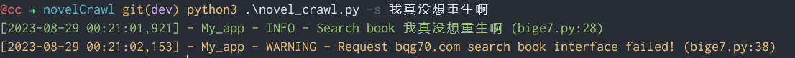

# 1. 笔趣阁小说爬取

## 1.1. 数据来源

目前仅支持以下站点
```
https://www.bqg70.com/
```

目前仅支持`python3`

## 1.2. 安装

```bash
pip3 install -r requirements.txt
```

## 1.3. 使用

### 1.3.1. 搜索小说

```bash
python3 crawl.py -s 我家娘子
python3 crawl.py --search 我家娘子
```
以下为搜索失败图片


搜索成功则会有表格显示信息
## 1.4. 爬取小说

### 1.4.1. 参数说明

注意参数仅能选其中一项,选择哪个参数需要对应搜索结果，根据下表进行对应

| 参数  | 长参数        | 来源       |
|:---:|:----------:|:--------:|
| -b  | --bqg7     | bqg70    |

### 1.4.2. 实际使用命令

```bash
# 第一行为说明,其余为实际使用
python3 novel_crawl.py -i [上方搜索出来的书籍号] -[上方搜索后对应数据ID来源的命令参数，可在1.4.1中对应查看]
python3 novel_crawl.py --id 40153 --bqg7 # 爬取《大明第一臣》
python3 novel_crawl.py --id 154288 -b # 爬取《大明第一臣》
# 以上命令均将小说下载到当前目录的download目录下,如果要更改目录则使用-p参数
python3 novel_crawl.py -i 40153 -b -p [相对路径或绝对路径]
python3 novel_crawl.py -i 40153 -b -p ./download/
# 正常爬取小说时使用10个线程数,如果需要更改线程数，则使用-t参数
python3 novel_crawl.py -i 40153 -b -p ./download/ -t [线程数]
python3 novel_crawl.py -i 40153 -b -p ./download/ -t 20
```


## 1.5. Calibre打开效果


## 1.6. 后记
小说爬取后会保存到当前目录下的download目录下
格式为epub格式
之前版本为txt格式 epub格式导入目前没遇到什么问题
搜索接口API经常出现搜索错误问题 非代码本身原因 后续多添加网站解决

界面地址

[novelCrawlGUI](https://github.com/cmacckk/novelCrawlGUI)
使用PyQt6编写 暂时还没同步命令行版本 有空再写了
